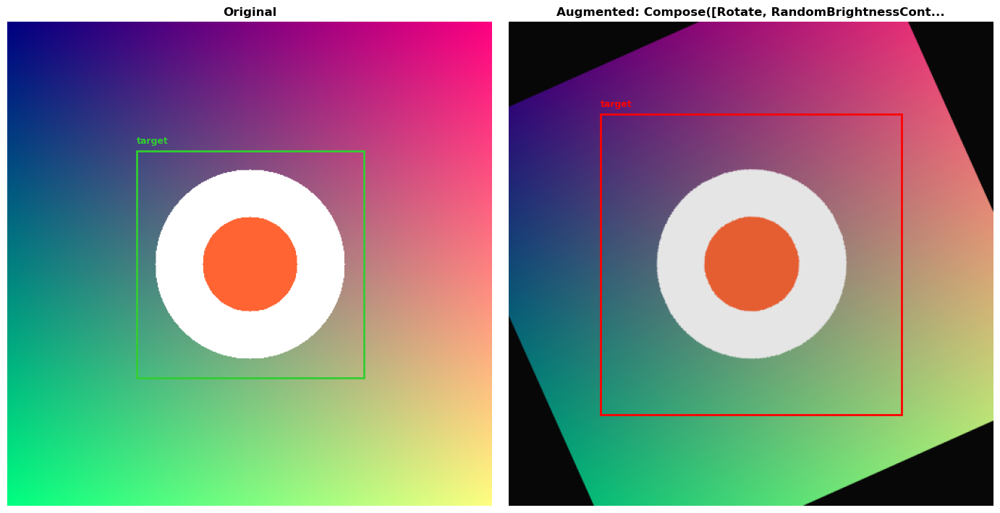

# AugmentLens

[](LICENSE)
[](https://python.org)
[](tests/)

> **Debug your Computer Vision pipeline in 1 line of code.**

Stop guessing if your augmentation broke your data. See it instantly.

---

## The Problem

You're training an object detection model. Your augmentation pipeline includes rotation, flips, and crops. Suddenly, your training crashes with:

```
ValueError: Bounding box x_min (-0.00001) is out of bounds
```

Or worse — training completes, but mAP is garbage because your masks got corrupted silently.

**AugmentLens** intercepts your pipeline, captures before/after snapshots, and renders them side-by-side so you can *see* exactly what's happening.

---

## Before vs. After



*Left: Original image with bounding box (green). Right: After Rotate + BrightnessContrast (red).*

---

## Key Features

| Feature | Why It Matters |
|---------|----------------|
| **Production Safe** | `passthrough=True` for zero overhead in training |
| **Framework Agnostic** | Works with Albumentations (Torchvision coming soon) |
| **Crash Proof** | Auto-clamps bounding boxes — no more `-1e-9` training crashes |
| **Drop-in Replacement** | Replace `A.Compose(...)` with `PipelineHook(A.Compose(...))` — nothing else changes |
| **Shape Hell Solved** | Handles CHW/HWC, float/uint8, Tensor/ndarray automatically |

---

## Why AugmentLens?

| Feature | Standard Albumentations | With AugmentLens |
|---------|-------------------------|------------------|
| Visualization | Manual `plt.imshow` calls | Automatic Side-by-Side |
| Debugging | Print statements | Visual Pipeline Hook |
| Production | Requires code changes | Zero-overhead (pass-through) |

---

## Quick Start

### Installation

Install directly from source:

```bash
git clone https://github.com/Mohamedhendawy312/augmentlens.git
cd augmentlens
pip install -e ".[dev]"
```

### Usage (3 Lines)

```python
import albumentations as A
from augmentlens import PipelineHook, MatplotlibRenderer

# Wrap your existing pipeline
aug = PipelineHook(A.Compose([
    A.Rotate(limit=45, p=1.0),
    A.RandomBrightnessContrast(p=1.0),
], bbox_params=A.BboxParams(format="pascal_voc", label_fields=["labels"])))

# Use exactly as before
result = aug(image=img, bboxes=boxes, labels=labels)

# Visualize the before/after
renderer = MatplotlibRenderer()
renderer.render(aug.latest_capture, save_path="debug.png")
```

### Production Mode

Zero overhead when you don't need debugging:

```python
# Training mode — no capture, no slowdown
aug = PipelineHook(my_pipeline, passthrough=True)
```

---

## Advanced Usage

### Access Raw Snapshot Data

```python
snapshot = aug.latest_capture

# Before/after frames
snapshot.raw_frame           # Original image (numpy array)
snapshot.augmented_frame     # After augmentation

# Bounding boxes
snapshot.raw_bounding_boxes       # Original boxes
snapshot.augmented_bounding_boxes # Transformed boxes

# Masks
snapshot.raw_segmentation_mask
snapshot.augmented_segmentation_mask

# Metadata
snapshot.transform_name       # "Compose([Rotate, RandomBrightnessContrast])"
snapshot.transform_parameters # {"probability": 1.0}
```

### Mask Survival Analysis

Check if your augmentation is destroying your segmentation masks:

```python
survival_ratio = snapshot.quantify_mask_integrity()
print(f"Mask survival: {survival_ratio:.1%}")  # e.g., "Mask survival: 87.3%"
```

---

## Future Ideas

Completed features:

- [x] Albumentations adapter
- [x] Matplotlib renderer
- [x] Bounding box auto-clamping

Possible extensions (contributions welcome!):

- [ ] Torchvision adapter
- [ ] HTML report export
- [ ] Jupyter widget integration
- [ ] TensorBoard logger

---

## Development

```bash
# Install with dev dependencies
pip install -e ".[dev]"

# Run tests
pytest tests/ -v

# Run demo
python examples/demo_quickstart.py
```

---

## License

MIT License — see [LICENSE](LICENSE) for details.

---

<p align="center">
  <strong>Built for engineers who debug with their eyes, not just logs.</strong>
</p>
